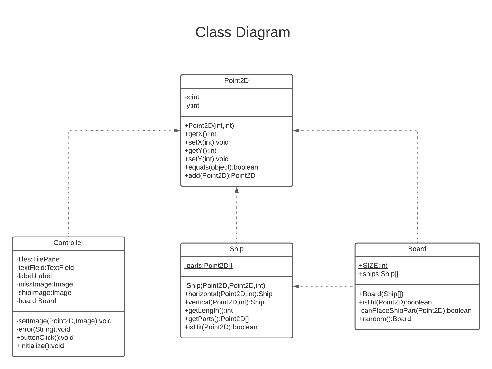

# Battleship

## Project group
* Obinna Stanley Obika 300314126
* Sevilay Ardik 300323961
* Sergei Protasov 300245809

## Installation
https://www.jetbrains.com/help/idea/javafx.html

## Added features
There are six ships on the board that are randomly allocated. The algorithms tries to place a ship at a random place on the board, while checking for the following constraints:
1. A ship must be inside the board
2. Ships cannot overlap and cannot touch each other

After the suitable place is found, the ship is added to the board.

## Class diagram
